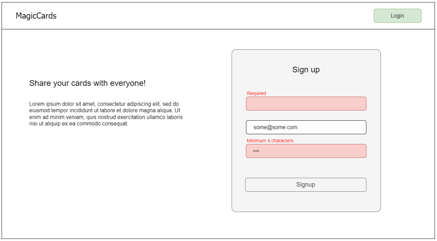

# Final Assignment
## The Task:

It is necessary to build a SPA based on CRA using a technology stack:

* To build the user interface - React.js
* To create a navigation system - React Router
* For application state management - Redux / React Redux / Redux Toolkit

In doing so, the following requirements must be observed:

## Navigation System:

* Should contain two main categories with corresponding routes:
  - Auth: “/login”, “/signup” (available only to unauthorized users)
  - Protected: “/feed”, “/profile” (available only to authorized users)
* If the user is not authorized, when trying to access any address other than Auth category, the system should redirect him to "/login", and after successful authorization, redirect him to the address to which the transition was originally attempted.
* If an authorized user tries to access '/' you should redirect him to '/feed'.
* If an authorized user tries to access routes of the “Auth” category, he should be redirected to "/feed".
* If an authorized user tries to access routes that do not exist, display page “NotFound”.

## Header:
On the left side, always display the "MagicCards" link leading to "/".

Display on the right side:
* The “Sign Up” button if the user is not authorized and is on the “Login” page. (The button should redirect to the "/signup").

* The “Login” button if the user is not authorized and is located on the “Signup” (The button should redirect to the "/login").

* If the user is authorized: The “My Profile” link (should redirect to "/profile") and the “Create Card” button that opens the “сreateCard popup”.

## CreateCard Popup:
The popup contains a single-line “Title” input field, a multi-line “Description” input field, a “Create” button, a “Cancel” button and a “Cross” icon.

The “Cancel” button and the “Cross” icon close the popup.

The Create button is available only if all fields are not empty. When the user clicks on it, the system should add a new card with the corresponding data to the “allCards” array (see section Data) and of course, instantly apply the changes in the application.

## Login Page:
On the left side of the screen, display a welcome text.

On the right side of the screen, display the login form with the “email” and “password” fields, the “Remember Me” checkbox and the “Login” button.

The “Login” button is available only if the fields (“email” and “password”) are not empty.

If the user tries to authorize with incorrect data, only the general error "Your email or password is not correct" should be displayed.

If the user changes any of the fields (“email” and “password”), the error should disappear.

**[Optional]** If the user logged in with the "Remember Me" option enabled, then when the page is reloaded, the system should automatically reauthorize the user (you can use localStorage to store the relevant data) until the user logs out.

When a user clicks on the “Login” button and successfully validates the fields, the system should authorize the user (save authorization data). Redirection must occur in accordance with the requirements described in the “Navigation System” section.

## Signup Page:

On the left side of the screen, display a welcome text (as on the Login page).

On the right side of the screen, display the signup form with the “name”, “email”, “password”  fields and the “Sign up” button.

The "Sign Up" button is available only if all fields are not empty and there are no validation errors.

When the user clicks the "Sign Up" button, the system must save the data to the “allUsers” array(see section Data) to the browser's local storage and perform the authorization procedure.
Validation

### Signup Page: Validation
Field validation happens after the field loses focus.

The validation error should be displayed above the field where the error occurred.

Changing the value of a field removes the error (if there was one) for that field.

Before validating the "name" and "email" fields, you need to remove any spaces and indents at the beginning and end of the value.

Validation rules for all fields:

* Required
* Minimum number of characters: 4
* Maximum number of characters: 40

## Feed Page:

Displays a sidebar on the left side.

On the right side displays a list of cards.

### Sidebar:

The sidebar is fixed positioned and displays a list of the names of all registered users except for the current user.

When clicking on the user name, the system should redirect the user to the page "/profile/<userId>".

If the list of user names is empty, the system should display the message "There are no other users in the system yet".

### List of cards:

At the top of the list should be the filter switch "All" and "Favorites", as well as a switch button to sort by date (ascending and descending).

By default, the list of cards contains all cards of all users, sorted by creation date from newest to oldest.

When scrolling the list by more than the height of the viewport, it is necessary to display a fixed positioned button “Scroll Up” in the lower right corner. When a user clicks on this button, the system should auto-scroll to the very top of the document.

If the list of cards is empty, the system should display the message "There are no cards in the system yet".

### Card:

The card should display the following information:

- Title
- Text
- Author
- Date of creation
- Button "Favorites" - displays the status of being added to favorites for the current user. When pressed, adds or removes this card from the list of favorite cards.

Cards owned by the current user have a different background color and an “Edit” button.

When the user clicks on the “Edit” button, the system should replace the “Title” and “Description” with the corresponding input fields with the “Title” and “Description” values respectively, display the “Save” and “Cancel” buttons and hide the “Edit” button.

meet the following conditions:
* If at least one field is empty, the “Save” button is disabled.

* If the “Save” button is pressed, it applies changes to the data.
* If the “Cancel” button is pressed, the changes are not applied.
* Pressing any button (“Save” or “Cancel”) returns text blocks instead of input fields and shows the “Edit” button.

## Profile Page:
* If the address is "/profile" the system displays information about the current user.
* If the address is "/profile/<userId>" the system displays the user information with the corresponding id.
* The username should be displayed on the page.
* The page should display filter buttons, a sort switcher, and a list of cards exactly like the Feed page. The list of cards should contain only cards belonging to the user of the current profile.

## NotFound Page:
Display the message: “Sorry, the page you are looking for does not exist or has been deleted”.

## Data
When authorizing, the application must pull out two data arrays of allUsers and allCards from the browser's local storage. This should be done with the following code:

    function fakeFetch(key) {
      return new Promise((resolve, reject) => {
        setTimeout(() => {
          const randomNum = Math.random();
          if (randomNum < 0.3) reject();

          const result = localStorage.getItem(key);

          if (!result) {
            localStorage.setItem(key, '[]');
            resolve([]);
          }

          resolve(JSON.parse(result));
        }, 2000);
      })
    }

In any convenient way, let the user know that the data is being loaded.

allUsers Model:

    [
      {
        name: string
        email: string
        password: string
        id: string
        cardIds: string[]
        favoriteIds: string[]
      }
    ]

allCards Model:

    [
      {
        title: string
        description: string
        creationDate: string
        authorId: string
        id: string
      }
    ]

All other data manipulations can be performed directly (synchronously).
